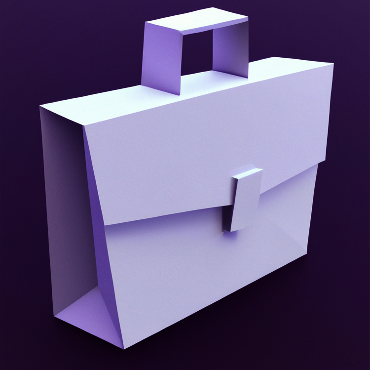

# AFTERLAND

Afterland is a single player, puzzle, 3D video game where we will be an office worker who seeks to escape from the office where he is solving the puzzles and finding the right path.

This is a game being developed by students from <a href="https://www.imagecampus.edu.ar/">Image Campus</a>

   

## Credits

- **Mauro Mendoza** - *Programming*
- **Juan Rodriguez Giles** - *Programming*
- **Francisco Rodriguez** - *Art*
- **Gonzalo Beraza** - *Game Desing*
- **Augusto Llanos** - *Game Desing*
- **Juan Manuel Del Valle** - *Game Desing*

This game was also possible thanks to the support of these professors:

- **Rodrigo Andres Magariños**
- **Andres Vergez**

## Links

Download it from itch.io: https://maurus.itch.io/afterland
